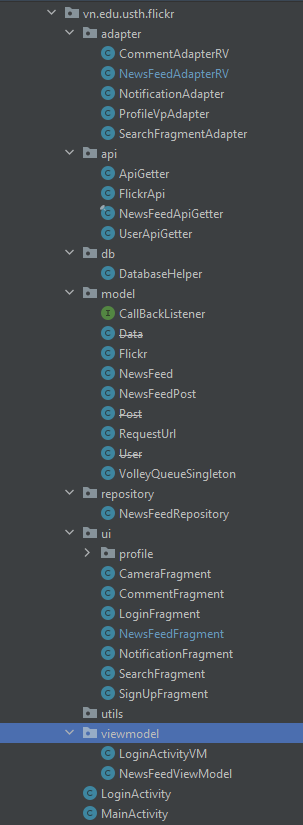
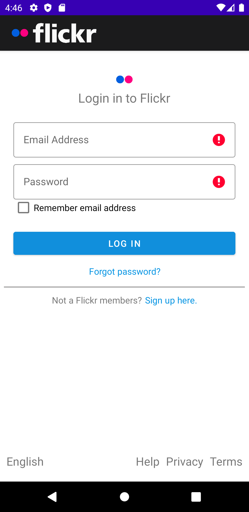
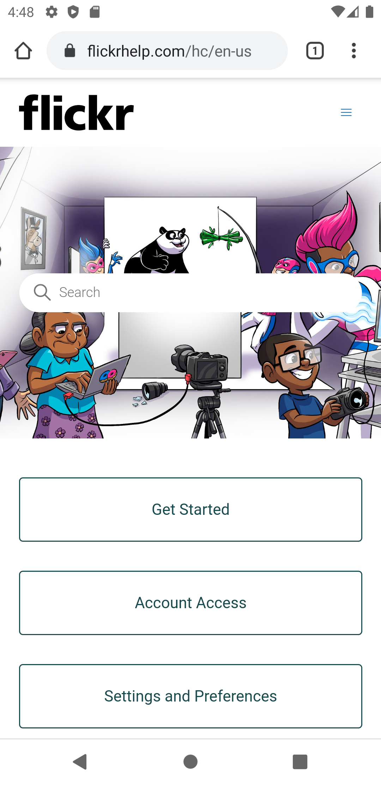

<div align="center">

##### Mobile Android Application

# **Report Project: FLICKR IMAGE BROWSER**

&nbsp;

**Group: 11**

**University of Science and Technology of Hanoi**

May 2021

&nbsp; &nbsp;

## **Group members**

```
Lê Anh Tú

Lê Duy

Phạm Tuấn Thành 

Đỗ Mạnh Thắng
``` 

 </div>

## **TABLE OF CONTENTS**

- [I/ Introduction](#intro)
    + [1. What is Flickr](#intro1)
    + [2. Approaches](#intro2)
    + [3. Preparations](#intro3)
        * [a) Software and tools](#intro31)
        * [b) Modules](#intro32)

- [II/ Implementation](#implementation)
    + [1. Planing](#implementation1)
    + [2. Database schema](#implementation2)
        * [a) Relationship between tables](#implementation21)
        * [b) Tables functions](#implementation22)
    + [3. Project Architecture](#implementation3)
    + [4. Modules, Classes and Packages](#implementation4)
        * [a) Database Script](#implementation4a)
        * [b) Database Information Scripts](#implementation4b)
        * [c) Hotel Management](#implementation4c)

- [III/ Results](#results)
    + [1. Main Frame](#results1)
    + [2. Check in](#results2)
    + [3. Room manage](#results3)
    + [4. Room order](#results4)
    + [5. Check out](#results5)
    + [6. History](#results6)
    + [7. Themes](#results7)

- [IV/ Conclusion](#conclusion)

## I/ Introduction <a name="intro"></a>

### 1. What is Flickr <a name="intro1"></a>

&ensp;&ensp;&ensp;Flickr is a photo-centric platform that allows professionals and amateur photographers to showcase
their work while also admiring the work of others. It devotes more attention to the art of photography than any other
major social media platform.

### 2. Approaches <a name="intro2"></a>

&ensp;&ensp;&ensp;First, the program is designed with a convenient and easy-to-use interface, easy to look up,
minimizing unnecessary risks that manual room registration encounters, such as wrong check-in date, wrong service, etc.
One of the reasons that make our program valuable is our service. We are friendly, responsible and quick to respond.
Additionally, our program has open source that is free to use.

&ensp;&ensp;&ensp;Implementing the idea, our team developed a system to simplify the work of a manager. We have also
written functions that help managers handle customer transactions such as check-in, customer information entry, room
management, service order entry, payment entry and record keeping of incoming guests.

&ensp;&ensp;&ensp;The main aim of the entire activity is to automate the process of day to day activities of hotels like
room activities, admission of a new customer, assign a room according to customer's demand, checkout of a computer and
releasing the room and finally compute the bill etc.

### 3. Preparations <a name="intro3"></a>

#### a) Software and Tools <a name="intro31"></a>

- OS: Windows 10
- Environment: Android SDK 11
- Database: SQLite
- Storage: Github
- IDE: Android Studio

#### b) Library <a name="intro32"></a>

    + navigation-fragment:2.3.5
    + navigation-ui:2.3.5
    + volley:1.2.1
    + link_builder:2.0.5
    + glide:4.12.0
    + compiler:4.12.0
    + picasso:2.71828

## II/ Implementation <a name="implementation"></a>

### 1. Planing <a name="implementation1"></a>

&ensp;&ensp;&ensp;To implement this project, we came up with the idea of creating 6 functions that perform different
tasks of the hotel management system:

```
Login:
    Input validation
    Register

Newsfeed:
    List of posts.
    Main image.
    Like and quantity.
    Comment and quantity.
    Comment fragment.
    User name
    Title
    Share
    
Search:
    Search bar.
    Default list of image.
    Photo, People, Groups fragmnet.
    
Camera:
    Galleries.
    Post image.
        
Notification:
    List of notification.
    
Profile:
    Background image.
    Buddy icon.
    Camera roll.
    Public.
    Albums.
    Groups.
    Stats.
    Sort function.    
```

### 2. Database Schema <a name="implementation2"></a>

&ensp;&ensp;&ensp;**Database** is an organized collection of structured information or data, usually stored in
electronic form in our systems. The diagram below is drawn to show the structure of the database. By using the database
diagram, we can create and modify the login and registration information of the user.

### 3. Project Architecture <a name="implementation3"></a>

&ensp;&ensp;&ensp;Model-View-ViewModel (MVVM) is a software design pattern that is structured to separate program logic
and user interface controls. MVVM is also known as model-view-binder.

&ensp;&ensp;&ensp;Like many other design patterns, MVVM helps organize code and break programs into modules to make
development, updating and reuse of code simpler and faster. The separation of the code in MVVM is divided into View,
ViewModel and Model:

+ View is the collection of visible elements, which also receives user input. This includes user interfaces (UI),
  animations and text. The content of View is not interacted with directly to change what is presented.


+ ViewModel is located between the View and Model layers. This is where the controls for interacting with View are
  housed, while binding is used to connect the UI elements in View to the controls in ViewModel.


+ Model houses the logic for the program, which is retrieved by the ViewModel upon its own receipt of input from the
  user through View.


### 4. Classes and Packages <a name="implementation4"></a>

&ensp;&ensp;&ensp;In real implementation, we separate classes into 8 package, each package do difference work:



1. Adapter is a class that have duty as a data controller and helps us to fill data in UI component. It holds the data
   and send the data to an Adapter view then view can take the data from the adapter view and shows the data on
   different recycler view in different fragment


2. API package responsible for performing and authorization for Api services.


3. Database package simply a single class that accessed, managed, modified, updated data for log in and sign up
   function.


4. The model implements business logic, represents the actual data and/or information we are dealing with. An example of
   a model might be a contact (containing name, phone number, address, etc.) or the characteristics of a live-streaming
   publishing point.


5. The objective of the repository package is to provide a clean API for accessing data. That is, the Repository can
   collect data from a variety of sources (including REST APIs, caching, and local database storage) and distribute it
   to the rest of the program. It also acts as a centralized source of information. Its job is to keep the local
   database updated with the most recent data obtained from the distant service so that the program may continue to
   function.


6. User interface (ui package) is a part of MVVM also call View. The structure, arrangement, and appearance of
   fragments. It shows a model representation and accepts user input (mouse clicks, keyboard input, screen tap gestures,
   and so on) and passes it on to the view model via the data binding (properties, event callbacks, and so on) that is
   defined to connect the view and view model.


7. The idea of utils was born will the idea that store utilities class with many helpful method inside which will make
   the hold concept faster and efficient


8. Final and the most important part, View-Model or binder is in charge of managing the interaction of the View with the
   relevant model classes. The ViewModel and Model classes usually have a one-to-many relationship. Views can select to
   expose model classes to the View directly, allowing controls in the View to connect data to them directly. Data
   binding and accompanying change notification events must be supported. The code below explain how we implement:

```java
public class NewsFeedViewModel extends ViewModel {
    private static MutableLiveData<ArrayList<NewsFeedPost>> newsFeedPosts = new MutableLiveData<>();
    private static NewsFeedViewModel instance;
    private static NewsFeedRepository newsFeedRepository;
    private static ArrayList<NewsFeedPost> list;

    private NewsFeedViewModel() {
    }

    public static NewsFeedViewModel getInstance() {
        if (instance == null) {
            instance = new NewsFeedViewModel();
            newsFeedRepository = NewsFeedRepository.getInstance();
            setNewsFeedPosts();
        }
        return instance;
    }

    public static void setNewsFeedPosts() {
        list = newsFeedRepository.fetchNewsFeed(); // get value
        newsFeedPosts = new MutableLiveData<>(list);
    }

    /*
     * updateNewsFeed = new value => append to list
     * => list updated => onChanged => observed
     * */
    public static void updateNewsFeedPosts() {
        ArrayList<NewsFeedPost> updateNewsFeed = newsFeedRepository.updateNewsFeed(); // get val
        list.addAll(updateNewsFeed);
        newsFeedPosts.postValue(list);
    }

    public LiveData<ArrayList<NewsFeedPost>> getNewsFeedPosts() {
        getInstance();
        return newsFeedPosts;
    }
}
```

And how Views can connect to View-Model at NewsFeedFragment.java

```java
public void setUpRecyclerViewDataFromViewModel(View view){
        setRecyclerViewWaiter(view);
        afterFinishGetDataOnBackGround(()->{
        setRecyclerViewRealData();
        NewsFeedAdapterRV.setReady(true);
        observeData();
        });
        }
```

## III/. Results <a name="results"></a>

### 1. Login <a name="results1"></a>

> Login Fragment is a content of Fragment View Container that contain many component as input to connect and perform query from database



### 2. Check In <a name="results2"></a>

>


### 3. Hyper Link <a name="results3"></a>

>


### 4. Room Order <a name="results4"></a>

### 5. Check Out <a name="results5"></a>

### 6. History <a name="results6"></a>

### 7. Themes <a name="results7"></a>


